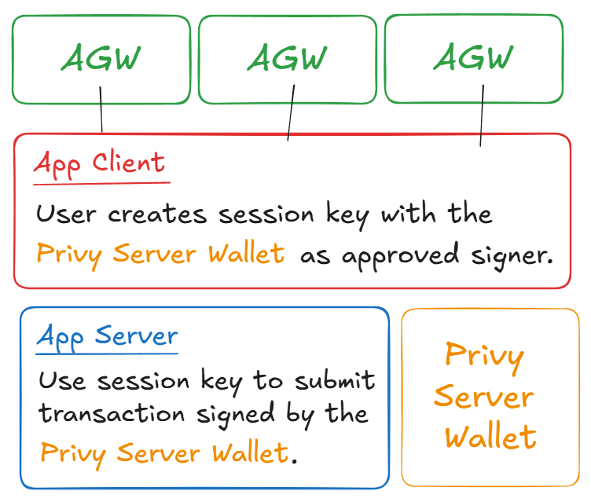

# Abstract Global Wallet Session Keys + Privy Server Wallets

This example shows you how to use [Privy Server Wallets](https://docs.privy.io/guide/server-wallets/)
as the signer wallet for [Abstract Global Wallet session keys](https://docs.abs.xyz/abstract-global-wallet/agw-client/session-keys/overview).
The Privy Server Wallet acts as a the "backend" wallet that is used as the signer approved to call transactions defined in the session key configuration.



## Local Development

1. Get a copy of the `agw-session-keys-privy-server-wallets` example directory:

   ```bash
   mkdir -p agw-session-keys-privy-server-wallets && curl -L https://codeload.github.com/Abstract-Foundation/examples/tar.gz/main | tar -xz --strip=2 -C agw-session-keys-privy-server-wallets examples-main/agw-session-keys-privy-server-wallets && cd agw-session-keys-privy-server-wallets
   ```

2. Install the dependencies:

   ```bash
   pnpm install
   ```

3. Start the local development server:

   ```bash
   pnpm run dev
   ```

4. Create the environment variables file:

   ```bash
   cp .env.example .env.local
   ```

5. Create a new Privy app from the [Privy dashboard](https://dashboard.privy.io/).

   Copy the **App ID** and **App Secret** from the **App Settings** tab.

   Add them as environment variables in the `.env.local` file:

   ```
   PRIVY_APP_ID=
   PRIVY_APP_SECRET=
   ```

6. Generate a random 32 length password (used for auth / sign in with Ethereum).

   ```bash
   openssl rand -hex 32
   ```

   Add it as the `IRON_SESSION_PASSWORD` environment variable in the `.env.local` file:

   ```
   IRON_SESSION_PASSWORD=
   ```

7. Create a new Privy server wallet.

   The [create route](./src/app/api/server-wallet/create/route.ts) contains the logic to create a new Privy server wallet. It logs the `walletId` and `address` of the server wallet into the console.

   Ping the server wallet creation endpoint to get these values:

   ```bash
   curl http://localhost:3000/api/server-wallet/create
   ```

   And add them as environment variables in the `.env.local` file:

   ```
   PRIVY_SERVER_WALLET_ID=
   PRIVY_SERVER_WALLET_ADDRESS=
   ```

   _Note_: This example shows how to create a single server wallet and use them for all session keys. Alternatively, you may opt to generate a new server wallet per user.

8. Visit [http://localhost:3000/](http://localhost:3000/) to test the app!

## How it works

The flow can be broken down into three key parts:

### 1. Creating the Server Wallet

First, the Privy Server Wallet is created. This serves as the "backend" wallet that we use for session keys. Since Privy uses a [Trusted Execution Environment (TEE)](https://docs.privy.io/guide/server-wallets/architecture#secure-enclaves), the private key of the wallet is never accessible to the developer and therefore cannot be leaked or misused.

```typescript
// Create a server wallet using Privy's API
const { id: walletId, address } = await privy.walletApi.create({
  chainType: "ethereum",
});
```

### 2. Session key creation

The user connects to the application with their Abstract Global Wallet, once connected, they are prompted (in a popup window) to approve the creation of a session key that can submit specific transactions on behalf of their wallet.

The session key is limited in scope; it is only permitted to call the `mint` function on an example NFT contract:

```typescript
// Session key scope:
{
    // ...
    callPolicies: [
      {
        target: "0xC4822AbB9F05646A9Ce44EFa6dDcda0Bf45595AA", // Example NFT Contract
        selector: toFunctionSelector("mint(address,uint256)"), // Allowed function (mint)
        // ...
      },
    ],
  };
```

If the user accepts the transaction, the session is created and, in this example, saved in local storage.

```typescript
const result = await createSessionAsync({
  session: sessionConfig,
});
```

Importantly, the **signer** (the wallet approved to sign transactions with the scope of the session key) is set to the Privy Server Wallet we created in step 1.

### 3. Send transactions using the session key.

Once the user has agreed to create the session key, we can submit transactions on behalf of their wallet (within the scope of the approved session key) from the Privy Server Wallet.

This occurs inside the [submit-tx](./src/app/api/server-wallet/submit-tx/route.ts) route.

First, we initialize the Viem account using the Privy server wallet (loaded from environment variables). We use a special import from Privy to do this:

```typescript
import { createViemAccount } from "@privy-io/server-auth/viem";

// Initialize Privy client using environment variables
const privy = new PrivyClient(
  process.env.PRIVY_APP_ID!,
  process.env.PRIVY_APP_SECRET!
);

// Create a viem account instance for the server wallet
const account = await createViemAccount({
  walletId: process.env.PRIVY_SERVER_WALLET_ID!,
  address: process.env.PRIVY_SERVER_WALLET_ADDRESS as Address,
  privy,
});
```

Now we have the Viem account setup with the Privy Server Wallet, we can pass it into the Abstract Global Wallet session client, so that it can sign transactions and send them on behalf of the AGW.

```typescript
// Initialize the AGW Session client to send transactions from the server wallet using the session key
const agwSessionClient = createSessionClient({
  account: agwAddress, // The AGW wallet address to send the transaction from
  chain,
  signer: account, // The Privy server wallet as the signer
  session: sessionConfig, // The session configuration loaded from local storage
});

// Use the session client to make transactions. e.g. mint NFT the AGW wallet address
const hash = await agwSessionClient.writeContract({
  account: agwAddress, // The AGW wallet address to send the transaction from
  chain,
  address: "0xC4822AbB9F05646A9Ce44EFa6dDcda0Bf45595AA", // The contract address to send the transaction to
  abi: parseAbi(["function mint(address,uint256) external"]), // The contract ABI
  functionName: "mint", // The contract function to call
  args: [agwAddress, BigInt(1)], // The function arguments (e.g. mint 1 NFT to the AGW wallet address)
});
```
